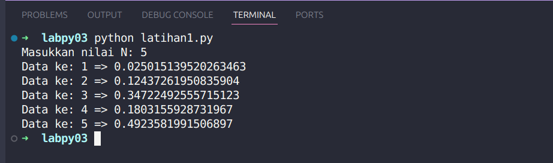

# Latihan1

## Deskripsi Program
Program sederhana untuk menghasilkan bilangan random (acak) dengan range 0 sampai 0.5 sebanyak N kali, dimana N adalah input dari user.

## Alur Algoritma
1. Program melakukan import library `random` untuk menggunakan fungsi bilangan acak

2. Program meminta user memasukkan nilai N sebagai jumlah bilangan yang akan digenerate
  - Input berupa bilangan bulat positif
  - Disimpan dalam variabel `n`

3. Program melakukan perulangan/loop sebanyak N kali:
  - Menggunakan fungsi `range(1, n+1)` agar loop mulai dari 1 sampai N
  - Di setiap loop:
    - Generate bilangan random antara 0-0.5 menggunakan `random.uniform()`
    - Tampilkan nomor data dan bilangan random yang dihasilkan

## Fungsi yang Digunakan
- `random.uniform(a,b)`: Menghasilkan bilangan random float antara a dan b
- `range(start,end)`: Membuat sequence bilangan dari start sampai end-1  
- `input()`: Menerima input dari user
- `int()`: Mengkonversi string menjadi integer
- `print()`: Menampilkan output ke layar

## Contoh Output

