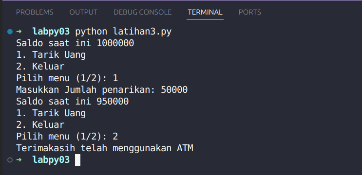

# Latihan1

## Deskripsi Program
Program sederhana untuk menghasilkan bilangan random (acak) dengan range 0 sampai 0.5 sebanyak N kali, dimana N adalah input dari user.

## Alur Algoritma
1. Program melakukan import library `random` untuk menggunakan fungsi bilangan acak

2. Program meminta user memasukkan nilai N sebagai jumlah bilangan yang akan digenerate
  - Input berupa bilangan bulat positif
  - Disimpan dalam variabel `n`

3. Program melakukan perulangan/loop sebanyak N kali:
  - Menggunakan fungsi `range(1, n+1)` agar loop mulai dari 1 sampai N
  - Di setiap loop:
    - Generate bilangan random antara 0-0.5 menggunakan `random.uniform()`
    - Tampilkan nomor data dan bilangan random yang dihasilkan

## Fungsi yang Digunakan
- `random.uniform(a,b)`: Menghasilkan bilangan random float antara a dan b
- `range(start,end)`: Membuat sequence bilangan dari start sampai end-1  
- `input()`: Menerima input dari user
- `int()`: Mengkonversi string menjadi integer
- `print()`: Menampilkan output ke layar

## Contoh Output

# Latihan2 

## Deskripsi Program
Program untuk menghitung laba bulanan berdasarkan persentase yang telah ditentukan dari modal awal. Program akan menampilkan laba per bulan dan total laba keseluruhan.

## Alur Algoritma
1. Inisialisasi data awal:
  - Modal awal ditetapkan sebesar 100.000.000
  - Array/List `laba_per_bulan` berisi persentase laba tiap bulan [0, 0, 1, 1, 5, 5, 5, 3]
  - Variabel `total_laba` diinisialisasi dengan nilai 0

2. Melakukan perulangan/loop menggunakan for loop untuk setiap bulan:
  - Menggunakan `enumerate()` agar mendapatkan indeks(i) dan nilai(laba)
  - Parameter `start=1` membuat indeks dimulai dari 1
  - Di setiap perulangan/loop:
    - Hitung laba bulan = (persentase / 100) × modal
    - Tambahkan laba bulan ke total laba

3. Menampilkan hasil:
  - Untuk bulan 1-2: tampilkan dalam bilangan bulat
  - Untuk bulan 3-8: tampilkan dengan 1 angka desimal
  - Di akhir tampilkan total laba

## Fungsi yang Digunakan
- `enumerate()`: Menghasilkan pasangan indeks dan nilai dari sequence
- `print()`: Menampilkan output ke layar
- Format string (f-string): Memformat output dengan spesifikasi tertentu
- `int()`: Mengkonversi ke bilangan bulat
- `.1f`: Format untuk menampilkan 1 angka di belakang koma

## Contoh Output

# Latihan3

## Deskripsi Program
Program ini merupakan simulasi ATM sederhana yang memungkinkan pengguna untuk melihat saldo, melakukan penarikan uang, atau keluar dari program. Program berjalan dalam loop sehingga pengguna dapat melakukan beberapa kali penarikan hingga saldo tidak mencukupi atau mereka memilih untuk keluar.

## Alur Algoritma
1. Inisialisasi data awal:
   - `saldo` ditetapkan sebesar 1,000,000 sebagai saldo awal.

2. Memasuki loop utama menggunakan `while True`:
   - Menampilkan saldo saat ini.
   - Menampilkan dua pilihan menu:
     - **1. Tarik Uang**
     - **2. Keluar**
   - Meminta input pengguna untuk memilih opsi.

3. Menangani pilihan pengguna:
   - **Jika pilihan adalah 1 (Tarik Uang)**:
     - Meminta pengguna memasukkan jumlah uang yang ingin ditarik.
     - Mengecek apakah saldo cukup untuk penarikan:
       - Jika saldo mencukupi, kurangi saldo sebesar jumlah yang dimasukkan.
       - Jika saldo tidak mencukupi, tampilkan pesan "Saldo Anda Tidak Cukup".
   - **Jika pilihan adalah 2 (Keluar)**:
     - Menampilkan pesan "Terimakasih telah menggunakan ATM" dan menghentikan loop menggunakan `break`.

4. Program berakhir setelah pengguna memilih untuk keluar.

## Fungsi yang Digunakan
- `while True`: Membuat loop tanpa batas hingga kondisi `break` terpenuhi.
- `print()`: Menampilkan teks atau informasi ke layar.
- `input()`: Mengambil input dari pengguna.
- `int()`: Mengkonversi input string dari pengguna menjadi integer untuk operasi aritmatika.
- `f-string`: Memformat teks yang akan ditampilkan, misalnya untuk menampilkan saldo dalam kalimat.

## Contoh Output

